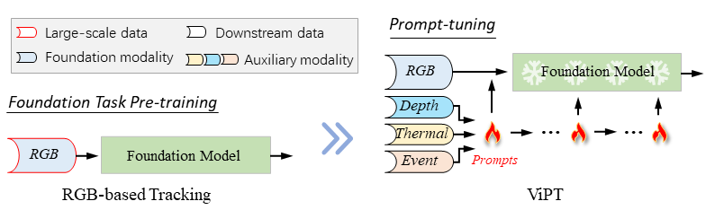
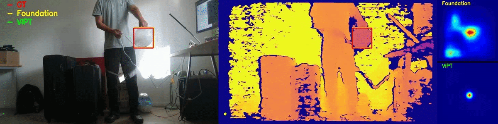
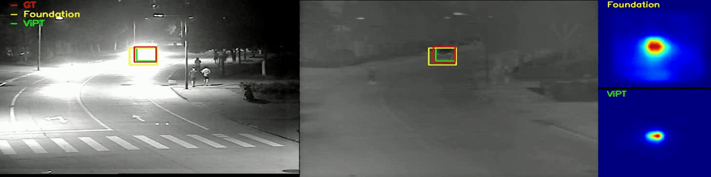
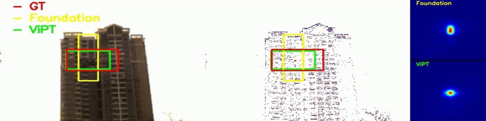
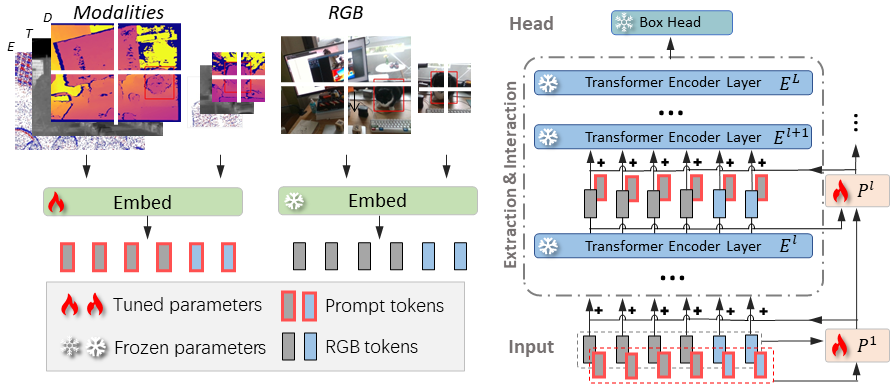
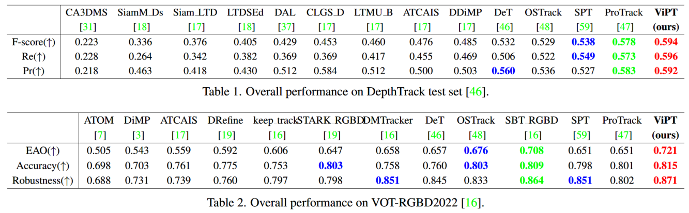
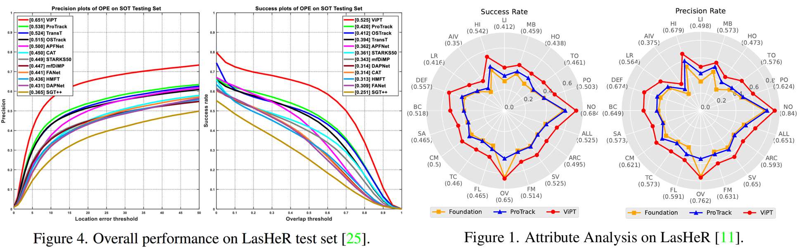
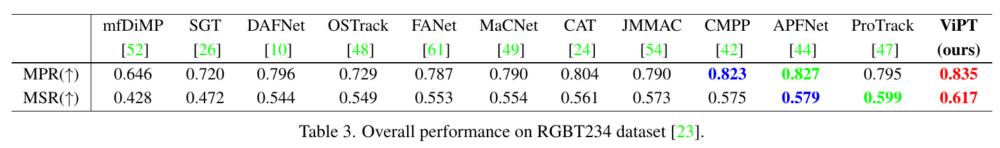
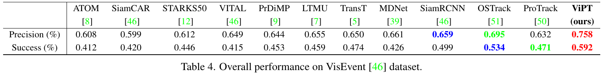

# Visual Prompt Multi-Modal Tracking [CVPR2023]
Official implementation of [**ViPT**](https://arxiv.org/abs/2303.10826), including models and training&testing codes.

[Models & Raw Results](https://drive.google.com/drive/folders/1RCuJjkOalP4-CNicgfdN_A9-K1H3GndI?usp=sharing)
(Google Driver)
[Models & Raw Results](https://pan.baidu.com/s/1ipKVj_CMjJ-u4cJAxXAWnw?pwd=vipt)
(Baidu Driver: vipt)

<center></center>

:fire::fire::fire: This work proposes ViPT, a new prompt-tuning framework for multi-modal tracking.

- Tracking in RGB + Depth scenarios:


  <center></center>

- Tracking in RGB + Thermal scenarios:


  <center></center>


- Tracking in RGB + Event scenarios:


  <center></center>

## News
**[Mar 20, 2023]**
- We release codes, models and raw results. \
Thanks for your star :stuck_out_tongue_closed_eyes::stuck_out_tongue_closed_eyes::stuck_out_tongue_closed_eyes:.

**[Feb 28, 2023]**

- ViPT is accepted to CVPR2023.

## Introduction
- :fire: A new unified visual prompt multi-modal tracking framework (e.g. RGB-D, RGB-T, and RGB-E Tracking).

- ViPT has high performance on multiple multi-modal tracking tasks.

- ViPT is with high parameter-efficient tuning, containing only 0.84M trainable parameters (<1%).

- We expect ViPT can attract more attention to prompt learning :fire: for further research of multi-modal tracking.

<center></center>

## Results
### On RGB-D tracking benchmarks
<center></center>

### On RGB-T tracking benchmarks
<center></center>
<center></center>

### On RGB-E tracking benchmark
<center></center>

## Usage
### Installation
Create and activate a conda environment:
```
conda create -n vipt python=3.7
conda activate vipt
```
Install the required packages:
```
bash install_vipt.sh
```

### Data Preparation
Put the training datasets in ./data/. It should look like:
```
$<PATH_of_ViPT>
-- data
    -- DepthTrackTraining
        |-- adapter02_indoor
        |-- bag03_indoor
        |-- bag04_indoor
        ...
    -- LasHeR/train/trainingset
        |-- 1boygo
        |-- 1handsth
        ...
    -- VisEvent/train
        |-- 00142_tank_outdoor2
        |-- 00143_tank_outdoor2
        ...
        |-- trainlist.txt
```

### Path Setting
Run the following command to set paths:
```
cd <PATH_of_ViPT>
python tracking/create_default_local_file.py --workspace_dir . --data_dir ./data --save_dir ./output
```
You can also modify paths by these two files:
```
./lib/train/admin/local.py  # paths for training
./lib/test/evaluation/local.py  # paths for testing
```

### Training
Dowmload the pretrained [foundation model](https://drive.google.com/drive/folders/1ttafo0O5S9DXK2PX0YqPvPrQ-HWJjhSy?usp=sharing) (OSTrack) 
and put it under ./pretrained/.
```
bash train_vipt.sh
```
You can train models with various modalities and variants by modifying ```train_vipt.sh```.

### Testing
#### For RGB-D benchmarks
[DepthTrack Test set & VOT22_RGBD]\
These two benchmarks are evaluated using [VOT-toolkit](https://github.com/votchallenge/toolkit). \
You need to put the DepthTrack test set to```./Depthtrack_workspace/``` and name it 'sequences'.\
You need to download the corresponding test sequences at```./vot22_RGBD_workspace/```.

```
bash eval_rgbd.sh
```

#### For RGB-T benchmarks
[LasHeR & RGBT234] \
Modify the <DATASET_PATH> and <SAVE_PATH> in```./RGBT_workspace/test_rgbt_mgpus.py```, then run:
```
bash eval_rgbt.sh
```
We refer you to [LasHeR Toolkit](https://github.com/BUGPLEASEOUT/LasHeR) for LasHeR evaluation, 
and refer you to [MPR_MSR_Evaluation](https://sites.google.com/view/ahutracking001/) for RGBT234 evaluation.


#### For RGB-E benchmark
[VisEvent]\
Modify the <DATASET_PATH> and <SAVE_PATH> in```./RGBE_workspace/test_rgbe_mgpus.py```, then run:
```
bash eval_rgbe.sh
```
We refer you to [VisEvent_SOT_Benchmark](https://github.com/wangxiao5791509/VisEvent_SOT_Benchmark) for evaluation.


## Bixtex
If you find ViPT is helpful for your research, please consider citing:

```bibtex
@inproceedings{ViPT,
  title={Visual Prompt Multi-Modal Tracking},
  author={Jiawen, Zhu and Simiao, lai and Xin, Chen and Wang, Dong and Lu, Huchuan},
  booktitle={CVPR},
  year={2023}
}
```

## Acknowledgment
- This repo is based on [OSTrack](https://github.com/botaoye/OSTrack) which is an excellent work.
- We thank for the [PyTracking](https://github.com/visionml/pytracking) library, which helps us to quickly implement our ideas.

## Contact
If you have any question, feel free to email jiawen@mail.dlut.edu.cn. ^_^


